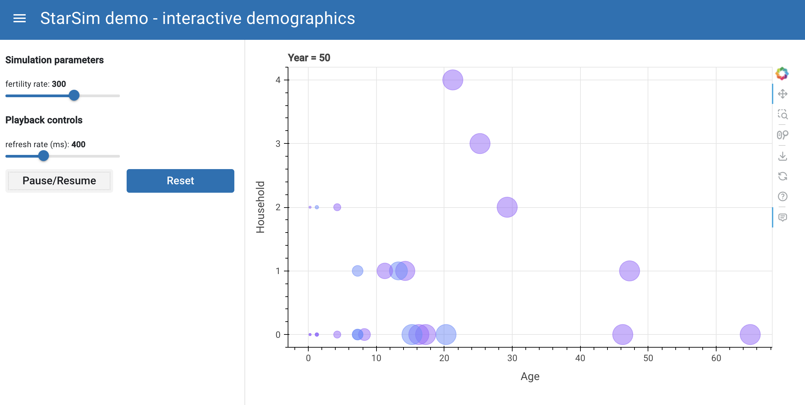

A demonstration project to assess approaches to interactive web applications to support science testing during model development within `starsim` framework

To explore interactive animation yourself in a browser, run the following Python commands:

`pip install -r requirements.txt`

`panel serve demo.ipynb --autoreload`

Then navigate to served site at: http://localhost:5006/demo

